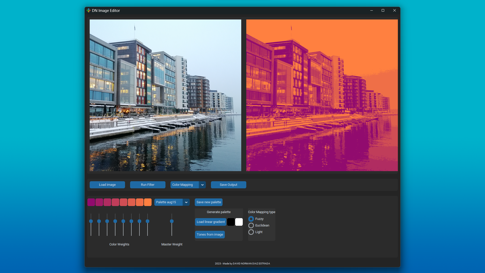
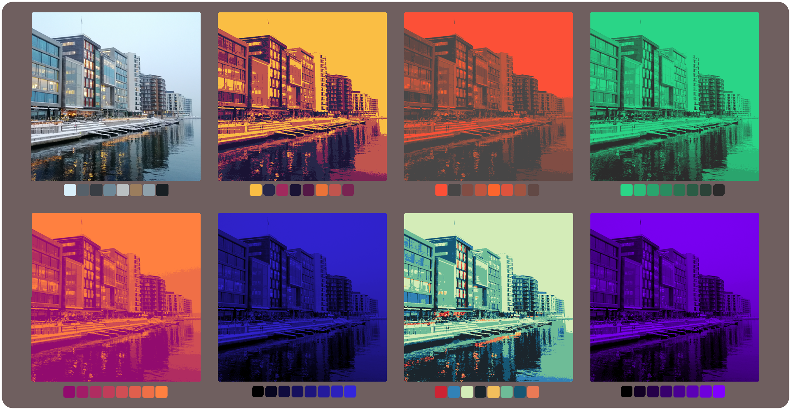

# DN_image_editor
A Python-based image editor made by [David Norman Díaz Estrada](https://www.linkedin.com/in/dnde7/)

------------------
**Color Mapping:** 
------------------
The Color Mapping filter allows to apply any 8-color palette to an input image.
The current version has the following features:
<ul>
  <li>Edit and save any custom palette.</li>
  <li>Palette generation using linear gradient between any 2 colors.</li>
  <li>Palette extraction from any image by using k-means algorithm (tones from image).</li>
  <li>Color mapping modes: Fuzzy, Euclidean, and Light-based.</li>
  <li>The Fuzzy mode allows to adjust the "weight" of each color during mapping, which the user can adjust with the sliders.</li>
</ul>

Here is an example of color Mapping using an image I took in Oslo:

These are some other examples with diverse palettes:

------------------
**Installation:** 
------------------
DN image editor requires the following dependencies: OpenCV, Scikit-learn, NumPy, Matplotlib, Tkinter, CustomTkinter, and Pillow.

